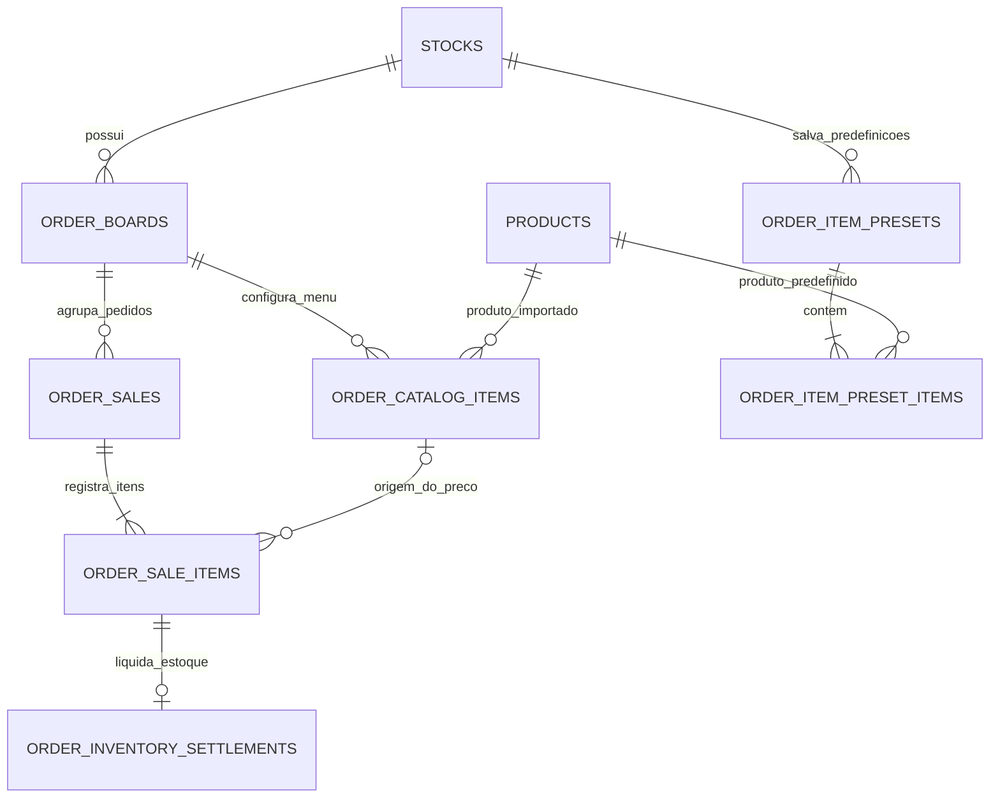

# Domínio de pedidos e Kanban

Cada Kanban pertence a um estoque. Ele possui um menu importado com preços próprios e concentra os pedidos de uma operação, dia ou equipe.

As tabelas físicas preservam os nomes usados pelas RPCs existentes. Para leituras novas, prefira estas views:

| View | Uso |
|---|---|
| `order_board_menu_items` | Produtos importados e preço configurado em cada Kanban. |
| `order_tickets` | Pedido, Kanban, status, totais, pagamento e horário. |
| `order_ticket_items` | Snapshot dos itens e preço que formaram cada pedido. |

`order_catalog_items` é menu de um Kanban, não o catálogo global de estoque. Além do preço de venda, pode ter `unit_cost` manual para itens que não possuem um custo FIFO disponível. `order_sales` representa um pedido e mantém o nome por compatibilidade. `order_sale_items` congela o preço no pedido e, ao finalizar, grava receita final alocada, custo total, origem, completude do custo e margem. Alterações futuras no catálogo e nos lotes não mudam esses valores.

Ao finalizar, cada item gera uma liquidação em `order_inventory_settlements`. A baixa consome o saldo FIFO disponível até zero, aponta para sua operação e salva o custo real; a diferença fica registrada como quantidade pendente. O estado da liquidação é `settled`, `partial` ou `pending`. O pedido sempre finaliza. Quando houver custo manual, ele cobre a parte sem estoque e o retrato informa origem `mixed`; sem custo manual, o dashboard sinaliza a margem como incompleta. Custos manuais ficam congelados no item do pedido.

No modo monólito pessoal, `migration_monolith_no_rls.sql` desativa RLS nas tabelas públicas. As RPCs continuam centralizando as validações operacionais de Kanban, produto, status e consistência do estoque.
