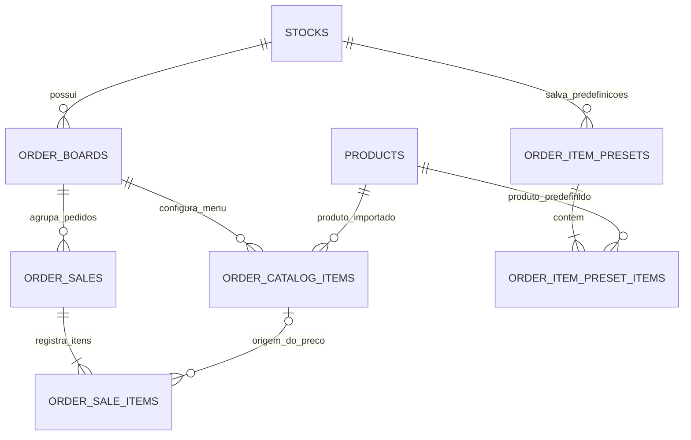

# Domínio de pedidos e Kanban

Cada Kanban pertence a um estoque. Ele possui um menu importado com preços próprios e concentra os pedidos de uma operação, dia ou equipe.

As tabelas físicas preservam nomes usados pelas RPCs e pelo serviço Spring. Para leituras novas, prefira estas views:

| View | Uso |
|---|---|
| `order_board_menu_items` | Produtos importados e preço configurado em cada Kanban. |
| `order_tickets` | Pedido, Kanban, status, totais, pagamento e horário. |
| `order_ticket_items` | Snapshot dos itens e preço que formaram cada pedido. |

`order_catalog_items` é menu de um Kanban, não o catálogo global de estoque. `order_sales` representa um pedido e mantém o nome por compatibilidade. `order_sale_items` guarda o retrato do pedido no momento da criação para que mudanças de preço futuras não alterem o histórico.

As views usam `security_invoker`; as políticas de RLS autorizam apenas o proprietário do estoque relacionado. Escritas seguem centralizadas nas RPCs, que validam Kanban, estoque, produto e status na mesma transação.
